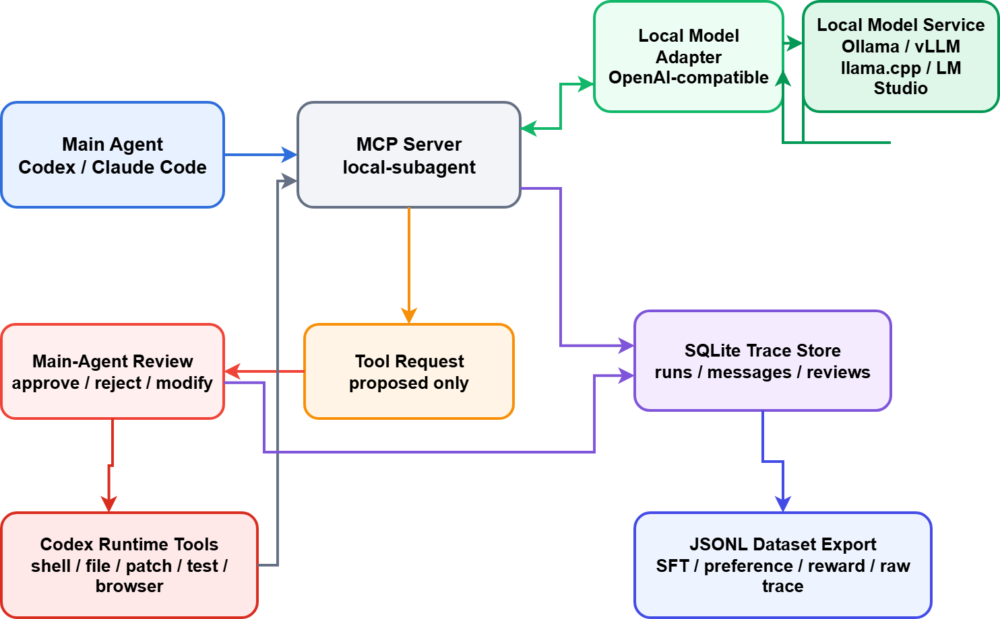

# Local Subagent MCP

Language: [繁體中文](README.zh-TW.md)

Local Subagent MCP is a local-first bridge between coding agents and local language models.

It lets a main agent, such as Codex or Claude Code, ask a local model to work as a subagent, then review what that subagent produced before anything risky happens. The local model can propose answers, reasoning, and tool requests. The main agent stays in charge of tool execution, review, debugging, and dataset labeling.

## What v1 Includes

- MCP tools for starting and continuing a subagent run
- Main-agent-mediated tool review loop
- SQLite persistence for runs, messages, tool requests, tool results, reviews, and exports
- JSONL export formats for raw trace, SFT, preference, and reward datasets
- A local FastMCP server entrypoint using stdio-friendly defaults

## Architecture



Editable diagram source: [local-subagent-architecture.drawio](local-subagent-architecture.drawio)

The local model service can be Ollama, vLLM, llama.cpp, LM Studio, or any OpenAI-compatible chat completion endpoint.

## Installation

```bash
python -m venv .venv
.venv\Scripts\activate
pip install -e .
```

## Configuration

The server reads these environment variables:

- `LOCAL_SUBAGENT_APP_NAME`
- `LOCAL_SUBAGENT_DATABASE_PATH`
- `LOCAL_SUBAGENT_EXPORT_DIR`
- `LOCAL_SUBAGENT_CONFIG_PATH`
- `LOCAL_SUBAGENT_RUNTIME_PROVIDER`
- `LOCAL_SUBAGENT_MODEL_BASE_URL`
- `LOCAL_SUBAGENT_MODEL_API_KEY`
- `LOCAL_SUBAGENT_MODEL_NAME`
- `LOCAL_SUBAGENT_TEMPERATURE`
- `LOCAL_SUBAGENT_MAX_TOKENS`

Default values:

```text
LOCAL_SUBAGENT_APP_NAME=local-subagent
LOCAL_SUBAGENT_DATABASE_PATH=local_subagent.db
LOCAL_SUBAGENT_EXPORT_DIR=exports
LOCAL_SUBAGENT_RUNTIME_PROVIDER=ollama
LOCAL_SUBAGENT_MODEL_BASE_URL=http://127.0.0.1:11434/v1
LOCAL_SUBAGENT_MODEL_API_KEY=ollama
LOCAL_SUBAGENT_MODEL_NAME=qwen3
LOCAL_SUBAGENT_TEMPERATURE=0.2
LOCAL_SUBAGENT_MAX_TOKENS=2000
```

If `LOCAL_SUBAGENT_CONFIG_PATH` points to a JSON file, the server loads runtime settings from that file first, then lets environment variables override them. This makes `npx` launches persistent without forcing users to manage a virtual environment manually.

If `LOCAL_SUBAGENT_CONFIG_PATH` is not set, the server chooses a default runtime config path based on the host agent environment:

- Codex with `CODEX_HOME`: `$CODEX_HOME/local-subagent-runtime.json`
- Codex without `CODEX_HOME` but with Codex marker env vars: `~/.codex/local-subagent-runtime.json`
- Claude Code: `~/.claude/local-subagent-runtime.json`
- Generic fallback: `~/.local-subagent/runtime.json`

Example for Ollama-compatible `/v1` usage:

```powershell
$env:LOCAL_SUBAGENT_MODEL_BASE_URL = "http://127.0.0.1:11434/v1"
$env:LOCAL_SUBAGENT_MODEL_API_KEY = "ollama"
$env:LOCAL_SUBAGENT_MODEL_NAME = "qwen3"
```

## Running The MCP Server

```bash
python -m local_subagent
```

Or, after editable install:

```bash
local-subagent
```

The server uses FastMCP and is intended for stdio-based local MCP clients.

## Runtime Onboarding

The MCP now exposes runtime onboarding tools so an agent can guide first-time setup:

- `subagent_get_runtime_status`
- `subagent_list_runtime_presets`
- `subagent_configure_runtime`
- `subagent_validate_runtime`

Recommended first-run flow:

1. Call `subagent_get_runtime_status`.
2. If setup is still using defaults, ask the user which runtime they use.
3. Call `subagent_list_runtime_presets` to inspect supported presets.
4. Call `subagent_configure_runtime` with the chosen preset and any custom URL or model name.
5. Call `subagent_validate_runtime` before starting a subagent task.

Supported presets:

- `ollama`
- `vllm`
- `lmstudio`
- `llamacpp`
- `openai_compatible`

When the runtime cannot be configured automatically, the tools return the local config path so the user can edit it directly.

## Running Through `npx`

After publishing the npm wrapper package, MCP clients can launch the server with:

```json
{
  "mcpServers": {
    "local-subagent": {
      "command": "npx",
      "args": ["-y", "@xu-0306/local-subagent-mcp@latest"]
    }
  }
}
```

The npm launcher boots a cached virtual environment on first run, installs this Python package, and then starts `python -m local_subagent`. The host machine still needs Python 3.12+ available on `PATH`.

## Release Notes

This project currently has two release surfaces:

- A Python package defined by `pyproject.toml`, which contains the actual `local_subagent` MCP server
- An npm package defined by `package.json`, which provides the `npx` launcher

Recommended release flow:

1. Update both versions
   - `package.json` `version`
   - `pyproject.toml` `project.version`
2. Run local verification
   - `pytest -q`
   - `node --check bin/local-subagent-mcp.js`
   - `python -m py_compile src/local_subagent/config.py src/local_subagent/service.py src/local_subagent/server.py src/local_subagent/runtime/adapter.py src/local_subagent/runtime/onboarding.py src/local_subagent/runtime/presets.py`
3. Log in to npm
   - `npm login`
4. Publish the npm package
   - `npm publish --access public`
5. Verify the published launcher from a real MCP client
   - configure `@xu-0306/local-subagent-mcp@latest`
   - call `subagent_get_runtime_status`
   - call `subagent_validate_runtime`

Important constraints:

- The npm package is currently a wrapper, not a standalone binary
- `npx` startup still requires local Python 3.12+
- If you want a fully self-contained install with no Python prerequisite, you will need either a Node/TypeScript server implementation or a separately packaged standalone binary

## Core MCP Tools

- `subagent_get_runtime_status`
- `subagent_list_runtime_presets`
- `subagent_configure_runtime`
- `subagent_validate_runtime`
- `subagent_start_task`
- `subagent_step`
- `subagent_submit_tool_result`
- `subagent_record_review`
- `subagent_export_dataset`
- `subagent_get_run`
- `subagent_list_runs`

## Example Workflow

1. Call `subagent_start_task` with the task and optional context.
2. If the subagent returns `tool_requests`, the main agent reviews them.
3. Send the decision and observation back with `subagent_submit_tool_result`.
4. Once the run is complete, store review labels with `subagent_record_review`.
5. Export reviewed traces with `subagent_export_dataset`.

## Dataset Outputs

- `raw_trace_jsonl`: full audit trace with review payload
- `sft_jsonl`: corrected answer appended as assistant output
- `preference_jsonl`: chosen vs. rejected answer pairs
- `reward_jsonl`: scored response plus review notes

## Running Tests

```bash
pytest -q
```

## Project Plan

For the implementation breakdown and checkpoints, see [docs/superpowers/plans/2026-06-01-local-subagent-mcp-v1.md](docs/superpowers/plans/2026-06-01-local-subagent-mcp-v1.md).

For the original product direction, see [LOCAL_SUBAGENT_MCP_PLAN.md](LOCAL_SUBAGENT_MCP_PLAN.md).
